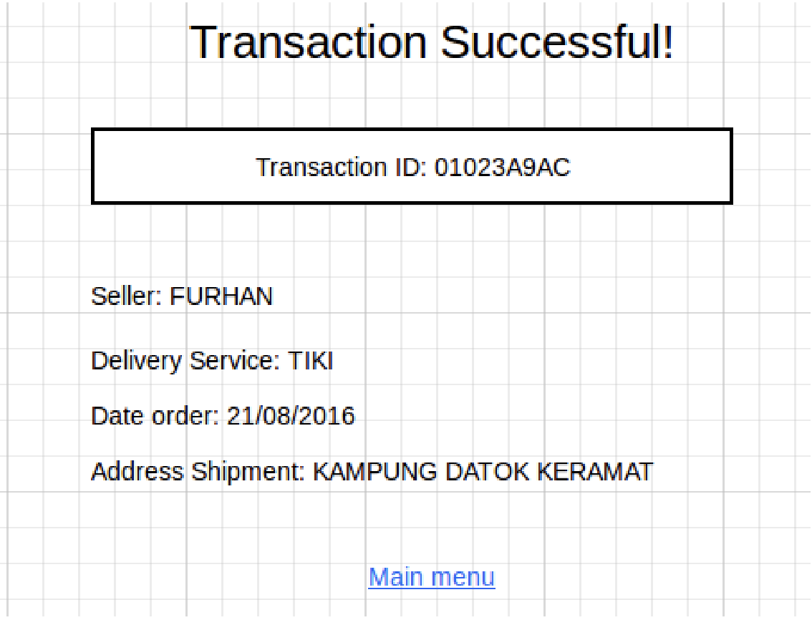
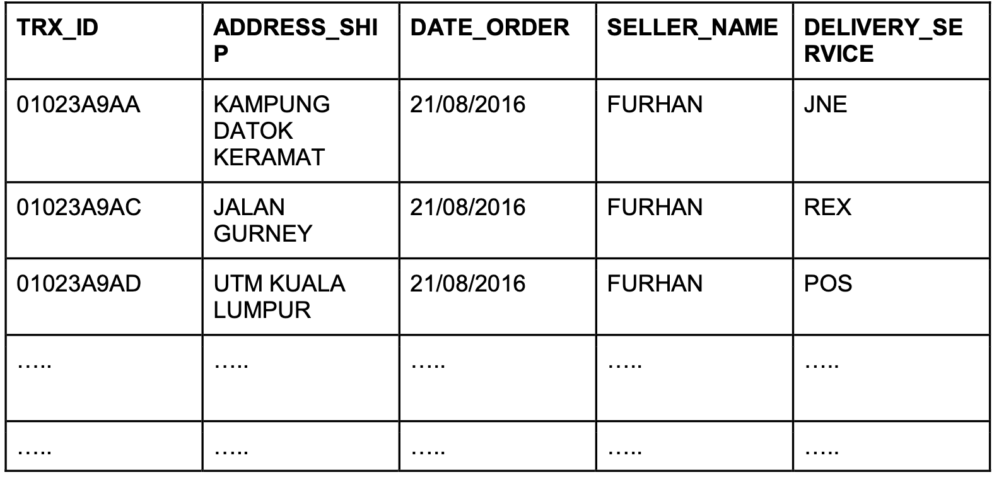

# Soal test maggang Quality Assurance engineer

Berikut adalah soal/pertanyaan yang perlu dijawab oleh peserta

## knowledge base

1. Apa yang anda ketahui tentang Rest API?
2. Apa yang anda ketahui tentang Server side and Client side processing?
3. Apa yang anda ketahui tentang Monolith dan Microservices, berikan contohnya?
4. Apa yang anda ketahui tentang Automation testing serta sebutkan contohnya?
5. Dengan menggunakan tools automation testing tersebut, biasanya menggunakan bahasa/tools apa?

## Use cases

Suppose there was a transaction that had been done in tokopedia.com , the transaction
id should be available on the screen alongside with the address of shipment, date of
order, seller’s name, and delivery service (JNE/POS/REX/others).
The transaction id (TRX_ID) should also be available on the database which again supposedly there was a simple table containing all the transaction data.

Apparently, the order `01023A9AC` seems to have different Delivery Service on the UI and the
database record. How do you, as automation test developers develop such test scenario so that
this kind of error does not occur?

# Jawaban soal test magang Quality Assurance engineer

## Knowledge base

### 1

REST API (Antarmuka Pemrograman Aplikasi Transfer Status Representasional) adalah seperangkat aturan dan konvensi untuk membangun dan berinteraksi dengan layanan web. Ini adalah gaya arsitektur yang banyak digunakan untuk merancang aplikasi jaringan, khususnya melalui HTTP (Hypertext Transfer Protocol). RESTful API biasanya digunakan untuk layanan web, dan memungkinkan sistem perangkat lunak yang berbeda untuk berkomunikasi satu sama lain melalui internet.
Karakteristik dan prinsip-prinsip utama REST API meliputi:

1. Statelessness: Setiap permintaan dari client ke server harus berisi semua informasi yang diperlukan untuk memahami dan memproses permintaan. Server tidak boleh menyimpan status client apa pun di antara permintaan. Hal ini membuat sistem menjadi sangat skalabel dan mudah dipelihara.
2. Sumber daya: Sumber daya adalah abstraksi utama dalam RESTful API. Sumber daya diidentifikasi oleh URI (Uniform Resource Identifiers) dan dapat mewakili konsep atau objek apa pun, seperti catatan data, objek, atau layanan.
3. Metode HTTP: REST API menggunakan metode HTTP standar untuk melakukan tindakan pada sumber daya. Metode HTTP yang paling umum digunakan dalam RESTful API adalah: - GET: Mengambil data dari server. - POST: Membuat sumber daya baru di server. - PUT: Memperbarui sumber daya yang sudah ada atau membuatnya jika tidak ada. - DELETE: Menghapus sumber daya dari server. - PATCH: Memperbarui sebagian sumber daya.
4. Antarmuka yang seragam: REST API memiliki antarmuka yang seragam dan konsisten, yang menyederhanakan interaksi antara client dan server. Konsistensi ini dicapai dengan mengikuti konvensi standar, seperti menggunakan metode HTTP untuk operasi tertentu.
5. Representasi: Sumber daya dapat memiliki beberapa representasi, seperti JSON, XML, HTML, atau lainnya. client dan server dapat menegosiasikan format representasi berdasarkan kemampuan dan preferensi mereka.
6. Stateless Communication: Setiap siklus permintaan-respons bersifat independen, dan server tidak menyimpan informasi tentang status client di antara permintaan. Setiap informasi status yang diperlukan harus disertakan dalam permintaan.
7. Sistem berlapis: Sistem RESTful dapat terdiri dari beberapa lapisan, dengan setiap lapisan bertanggung jawab atas aspek tertentu dari fungsionalitas sistem. Pemisahan masalah ini membuat arsitektur menjadi lebih modular dan dapat dipelihara.
8. Arsitektur Client-Server: Client dan server adalah entitas terpisah yang berkomunikasi melalui jaringan. Pemisahan ini memungkinkan skalabilitas, karena client dan server dapat berkembang secara independen.
9. Cacheability: Respons dari server dapat di-cache untuk meningkatkan kinerja dan mengurangi beban pada server.
   RESTful API banyak digunakan untuk membangun layanan web, karena API ini menyediakan cara yang sederhana dan terstandardisasi untuk berbagai aplikasi agar dapat berinteraksi satu sama lain. API ini biasanya digunakan dalam aplikasi web dan seluler untuk mengambil dan memanipulasi data dari server, dan API ini telah menjadi bagian mendasar dari pengembangan web modern.

### 2

Server-side processing dan client-side processing mengacu pada bagaimana data dan logika ditangani dalam aplikasi perangkat lunak, khususnya dalam konteks aplikasi web. Keduanya mewakili dua pendekatan yang berbeda dalam memproses data dan melakukan tugas, masing-masing dengan keunggulan dan kasus penggunaannya. Berikut ini adalah ikhtisar server-side processing dan client-side processing, beserta perbedaannya:

Server-side Processing:

        1) Definisi: Dalam server-side processing, sebagian besar pemrosesan data, logika bisnis, dan interaksi basis data terjadi di server. Server membangkitkan HTML dan mengirimkannya ke browser client sebagai halaman web yang lengkap.

        2) Karakteristik:
            - Server menangani pemrosesan data, autentikasi, dan operasi basis data.
            - Perenderan halaman dan pembuatan konten biasanya dilakukan di server.
            - Kode sisi server dapat ditulis dalam bahasa seperti PHP, Python, Ruby, Java, atau Node.js.
            - Biasanya, client menerima HTML yang dirender sepenuhnya, yang kemudian ditampilkan di browser.

        3) Keuntungan:
          - Keamanan yang ditingkatkan: Operasi dan data yang sensitif disimpan di server, sehingga mengurangi risiko keamanan di sisi client.
          - Performa yang lebih baik pada perangkat client yang lambat: Pemrosesan server membebankan tugas-tugas intensif sumber daya dari perangkat client.
          - Pemeliharaan yang lebih mudah: Perubahan dan update dapat dilakukan di server tanpa memerlukan update di sisi client.

Client-side processing

    1) Definisi: Dalam client-side processing, sebagian besar pemrosesan data dan eksekusi logika terjadi di browser web pengguna. Server terutama berfungsi sebagai sumber data dan melakukan autentikasi dan otorisasi.

    2) Karakteristik:
      - Aplikasi web menggunakan JavaScript dan pustaka serta kerangka kerja sisi client (misalnya, React, Angular, Vue.js) untuk menangani interaksi, rendering, dan manipulasi data.
      - API dan data diambil dari server, tetapi rendering dan update antarmuka pengguna dilakukan di browser.
      - Mengurangi kebutuhan untuk memuat ulang seluruh halaman web karena aplikasi sisi client dapat memperbarui bagian halaman secara dinamis.

    3) Keuntungan:
      - User experience yang lebih baik: Client-side processing memungkinkan aplikasi web yang dinamis dan responsif.
      - Mengurangi beban server: Pemrosesan yang dibebankan ke client dapat mengurangi beban komputasi server.
      - Mengurangi transfer data: Hanya data yang diperlukan yang diambil dari server, sehingga mengurangi penggunaan bandwidth.

Perbedaan:

      1) Lokasi Pemrosesan: Perbedaan utama adalah tempat pemrosesan terjadi. Pada server-side processing, server melakukan sebagian besar pemrosesan, sedangkan pada client-side processing, sebagian besar terjadi di browser pengguna.

      2) Performance: Server-side processing dapat menawarkan kinerja yang lebih baik pada perangkat client yang lambat karena server menangani tugas-tugas yang membutuhkan banyak sumber daya. Client-side processing dapat memberikan pengalaman pengguna yang lebih responsif, tetapi mungkin memerlukan lebih banyak sumber daya sisi client.

      3) Keamanan: Server-side processing umumnya dianggap lebih aman untuk operasi sensitif dan penanganan data karena server tidak terlalu terpapar pada gangguan sisi client. Client-side processing dapat menimbulkan risiko keamanan jika tidak diamankan dengan baik.

      4) Maintenance: Server-side processing dapat lebih mudah dipelihara karena perubahan dibuat di server dan memengaruhi semua client. Dalam client-side processing, update mungkin memerlukan perubahan kode sisi client dan masalah kompatibilitas.

      5) Network Traffic: Client-side processing dapat mengurangi lalu lintas jaringan dengan meminimalkan transfer data dan memungkinkan update dinamis tanpa memuat ulang halaman. Server-side processing biasanya melibatkan pengiriman halaman HTML yang dirender sepenuhnya.

Dalam praktiknya, banyak aplikasi web menggunakan kombinasi server-side processing dan client-side untuk mencapai fungsionalitas dan pengalaman pengguna yang diinginkan.

### 3

Dalam rekayasa perangkat lunak, "monolit" dan "microservices" adalah dua pendekatan arsitektur untuk merancang dan mengatur aplikasi perangkat lunak. Keduanya mewakili cara yang berbeda dalam menyusun dan menskalakan sistem perangkat lunak. Berikut ini adalah gambaran umum tentang monolit dan microservices, beserta perbedaan utamanya:

Monolith:

        1) Definisi: Arsitektur microservices dicirikan dengan membangun seluruh aplikasi sebagai satu unit yang digabungkan secara erat. Dalam monolit, semua komponen dan fungsi aplikasi terintegrasi erat dan berbagi basis kode, basis data, dan infrastruktur yang sama.

        2) Karakteristik:
           - Basis kode tunggal: Seluruh aplikasi ditulis dalam satu basis kode, biasanya menggunakan satu bahasa pemrograman dan kerangka kerja.
           - Tight Coupling: Komponen aplikasi saling berhubungan erat, sehingga sulit untuk memodifikasi atau menskalakan bagian tertentu secara independen.
           - Basis Data Tunggal: Aplikasi microservices biasanya memiliki satu basis data yang digunakan bersama oleh semua modul.
           - Penerapan sebagai Satu Unit: Seluruh aplikasi digunakan sebagai satu unit, yang dapat membuat penyebaran dan penskalaan menjadi rumit.

        3) Keuntungan:
           - Kesederhanaan: Monolit sering kali lebih sederhana untuk dikembangkan, diuji, dan pada awalnya diterapkan.
           - Debugging yang lebih mudah: Debugging bisa lebih mudah karena basis kode yang terpusat.
           - Kecepatan Pengembangan Awal: Mungkin lebih cepat untuk mengembangkan versi pertama aplikasi sebagai monolit.

        4) Tantangan:
           - Skalabilitas: Monolit dapat menjadi tantangan untuk menskalakan secara horizontal karena semua komponen digabungkan dengan erat.
           - Pemeliharaan: Seiring dengan pertumbuhan aplikasi, pemeliharaan dan pengembangan monolit dapat menjadi rumit.
           - Pembaruan yang Berisiko: Pembaruan atau perubahan dapat menimbulkan bug atau waktu henti untuk seluruh aplikasi.

Microservices

        1) Definisi: Arsitektur microservices adalah pendekatan di mana sebuah aplikasi dibagi menjadi beberapa layanan kecil yang digabungkan secara longgar yang dapat digunakan secara independen dan dapat diskalakan. Setiap layanan biasanya berfokus pada kemampuan atau fungsi bisnis tertentu.

        2) Karakteristik:
            - Terdesentralisasi: Layanan mikro adalah layanan terpisah dan otonom yang berkomunikasi melalui API atau pesan.
            - Penyebaran Independen: Setiap microservices dapat dikembangkan, diterapkan, dan ditingkatkan secara independen dari yang lain.
            - Poliglot: Layanan mikro yang berbeda dapat menggunakan teknologi, bahasa pemrograman, dan basis data yang berbeda, berdasarkan kebutuhan.
            - Data Terdistribusi: Layanan mikro dapat memiliki basis datanya sendiri, dan konsistensi data sering kali dikelola melalui komunikasi asinkron.

        3) Keuntungan:
            - Skalabilitas: Layanan mikro memungkinkan skalabilitas yang sangat halus, sehingga Anda dapat meningkatkan skala layanan yang membutuhkannya.
            - Pengembangan Independen: Tim dapat mengerjakan dan menerapkan layanan individual tanpa memengaruhi layanan lainnya, sehingga siklus pengembangan menjadi lebih cepat.
            - Isolasi Kesalahan: Masalah dalam satu microservices umumnya tidak memengaruhi keseluruhan sistem, sehingga meningkatkan toleransi kesalahan.
            - Keragaman Teknologi: Anda dapat memilih tumpukan teknologi terbaik untuk setiap kebutuhan microservices.

        4) Tantangan:
            - Kompleksitas: Layanan mikro memperkenalkan kompleksitas dalam hal komunikasi antar-layanan, penyebaran, dan manajemen.
            - Tantangan Sistem Terdistribusi: Membangun dan memelihara sistem terdistribusi dapat menjadi tantangan, termasuk menangani kegagalan jaringan dan konsistensi data.
            - Peningkatan Overhead: Mengelola beberapa layanan, basis data, dan saluran komunikasi dapat menambah biaya operasional.

Pilihan antara arsitektur microservices dan microservices bergantung pada faktor-faktor seperti ukuran dan kompleksitas aplikasi, struktur tim, kecepatan pengembangan, persyaratan skalabilitas, dan banyak lagi. Banyak aplikasi modern yang mengadopsi pendekatan hibrida, memanfaatkan kedua arsitektur tersebut untuk mencapai keseimbangan antara kesederhanaan dan fleksibilitas.
Contoh bagaimana arsitektur monolithic dan microservices dapat digunakan dalam pengembangan platform e-commerce:

Pendekatan Monolithic:

        1) Basis Kode Tunggal: Seluruh platform e-commerce, termasuk katalog produk, autentikasi pengguna, keranjang belanja, pemrosesan pesanan, dan penanganan pembayaran, ditulis dalam satu basis kode menggunakan bahasa pemrograman dan kerangka kerja tunggal.

        2) Integrasi yang ketat: Semua fungsi terintegrasi dengan erat di dalam monolit. Misalnya, menambahkan produk baru mungkin memerlukan perubahan pada basis kode yang sama yang menangani pemrosesan pesanan.

        3) Database Tunggal: Platform ini menggunakan database tunggal yang terpusat untuk menyimpan informasi produk, data pengguna, pesanan, dan banyak lagi.

        4) Penyebaran: Seluruh aplikasi disebarkan sebagai satu unit. Pembaruan atau perubahan pada bagian mana pun dari aplikasi memerlukan penerapan seluruh monolit.

Pendekatan Microservices:

        1) Pemisahan Layanan: Platform e-commerce dibagi menjadi beberapa microservices, masing-masing bertanggung jawab untuk fungsi yang berbeda. Sebagai contoh:
           - Layanan Produk mengelola katalog produk.
           - Layanan Pengguna menangani otentikasi dan profil pengguna.
           - Cart Service mengelola operasi keranjang belanja.
           - Order Service menangani pemrosesan pesanan.
           - Layanan Pembayaran menangani transaksi pembayaran.

        2) Terdesentralisasi: Setiap microservices beroperasi secara independen dan berkomunikasi dengan yang lain melalui API yang terdefinisi dengan baik atau pesan asinkron.

        3) Penyebaran Independen: Tim dapat bekerja dan menyebarkan setiap microservices secara independen. Misalnya, Layanan Produk dapat diperbarui tanpa memengaruhi Layanan Pesanan.

        4) Data Terdistribusi: Setiap microservices dapat memiliki basis data sendiri untuk mengelola data khusus untuk domainnya. Konsistensi dan sinkronisasi data dipertahankan melalui komunikasi antar layanan.

### 4

Automation testing adalah teknik pengujian perangkat lunak yang menggunakan skrip dan alat otomatis untuk melakukan kasus pengujian dan memverifikasi hasil yang diharapkan dari suatu aplikasi. Alih-alih mengeksekusi kasus pengujian secara manual, pengujian otomatisasi melibatkan penggunaan program perangkat lunak khusus untuk mengotomatiskan tugas pengujian yang berulang dan memakan waktu. Pendekatan ini menawarkan beberapa keuntungan dalam hal efisiensi, akurasi, dan pengulangan.
Contoh skenario untuk automated test:

1. Halaman Detail Produk:
   - Menguji fungsionalitas halaman detail produk.
   - Memastikan bahwa gambar produk, deskripsi, harga, dan ulasan pengguna ditampilkan secara akurat.
   - Memastikan pengguna dapat menavigasi kembali ke daftar produk.
2. Tambahkan ke Keranjang dan Pembayaran: - Uji menambahkan produk ke keranjang belanja.
   - Validasi bahwa keranjang belanja diperbarui dengan jumlah barang dan harga total yang benar.
   - Uji proses checkout, termasuk memasukkan informasi pengiriman dan detail pembayaran. - Mengkonfirmasi bahwa ringkasan pesanan ditampilkan dengan benar sebelum menyelesaikan pembelian.
3. Logout Pengguna:
   - Uji fungsionalitas logout.
   - Mengkonfirmasi bahwa pengguna berhasil keluar, dan sesi diakhiri.
   - Verifikasi bahwa halaman dan tindakan yang dibatasi tidak dapat diakses setelah logout.

### 5

Untuk automation testing, biasanya menggunakan Katalon Studio dan Selenium (dengan Cucumber dan Gherkin terintegrasi), dengan Java untuk bahasa pemrograman digunakan di Selenium

## Use cases

Untuk mencegah perbedaan seperti yang disebutkan antara UI dan catatan database dalam skenario yang melibatkan transaksi online, skenario automation testing yang mencakup UI dan database perlu dilakukan. Skenario langkah yang yang diambil dilakukan sebagai berikut:

1. Prasyarat
   - Akses ke platform tokopedia.com
   - Akses database untuk mengambil data transaksi.
2. Pengaturan Data Uji
   - Pastikan database berisi data pengujian yang relevan, termasuk catatan transaksi dengan ID transaksi, nama penjual, informasi layanan pengiriman, tanggal pemesanan, dan alamat pengiriman.
   - Identifikasi transaksi tertentu (misalnya, ID Transaksi: 01023A9AC) yang berpotensi memiliki perbedaan.
3. Langkah-langkah pengujian
   - Buka platform tokopedia.com menggunakan alat otomatisasi web atau browser.
   - Cari transaksi yang teridentifikasi (misal: dengan memberikan ID Transaksi) menggunakan fungsionalitas pencarian pada platform.
4. Ekstraksi Data UI (User Interface)
   Ekstrak informasi berikut dari UI :
   - ID Transaksi
   - Nama Penjual
   - Layanan Pengiriman
   - Tanggal Pemesanan
   - Alamat Pengiriman
5. Pengambilan Data Basis Data
   - Kueri database untuk mengambil catatan transaksi yang sesuai dengan ID Transaksi yang diidentifikasi.
6. Perbandingan Data
   - Bandingkan data yang diperoleh dari UI dengan data yang diambil dari database, dengan fokus khusus pada bidang layanan pengiriman.
   - Verifikasi bahwa informasi layanan pengiriman dari UI sesuai dengan informasi layanan pengiriman dalam database.
7. Penegasan
   - Jika terdapat ketidaksesuaian antara data UI dan database, catat masalah tersebut dan tandai pengujian sebagai gagal.
   - Jika datanya cocok, catat validasi yang berhasil.
8. Reporting
   - Buat laporan pengujian yang menyertakan hasil perbandingan.
   - Sertakan rincian tentang apakah informasi layanan pengiriman cocok atau jika terdeteksi adanya ketidaksesuaian.
     Skenario pengujian memastikan bahwa layanan pengiriman yang ditampilkan di UI untuk transaksi yang diidentifikasi sesuai dengan catatan yang sesuai di database. Jika perbedaan terdeteksi selama pengujian, maka akan dilaporkan, sehingga tim pengembangan dapat menyelidiki dan menyelesaikan masalah untuk memastikan konsistensi data bagi pengguna.
